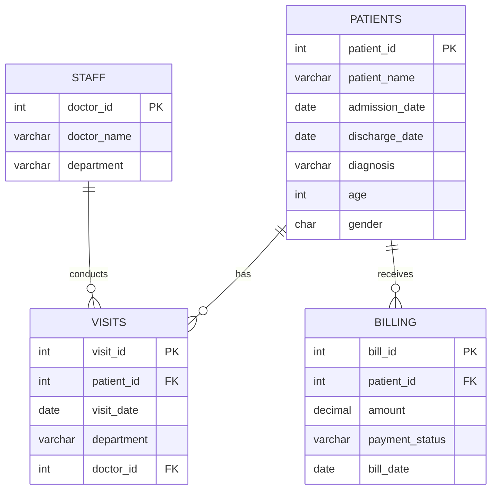
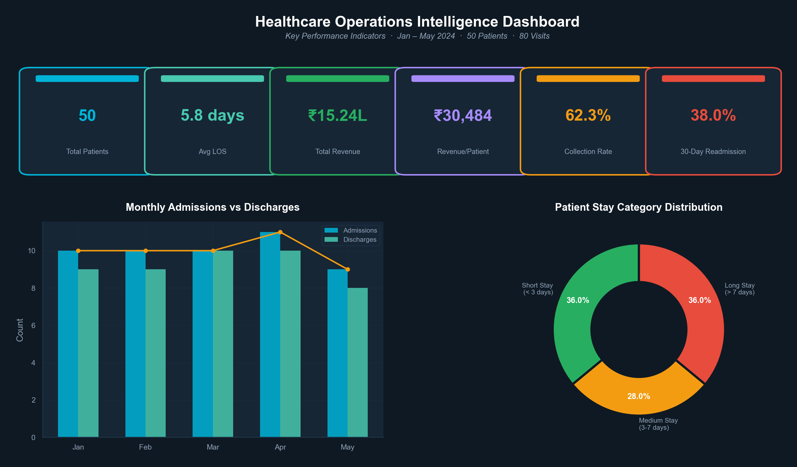
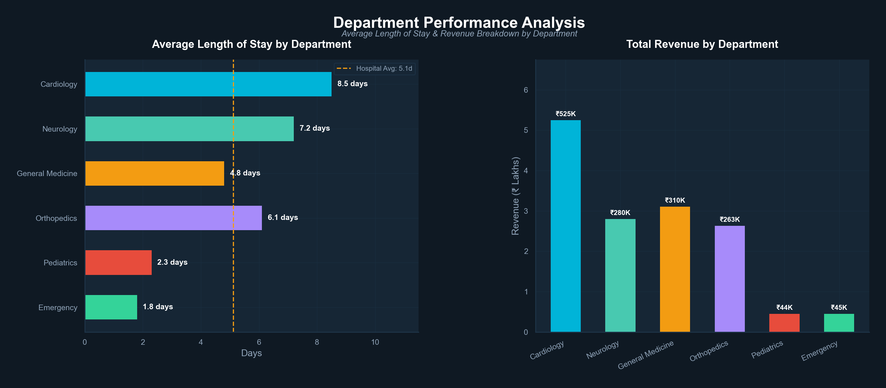
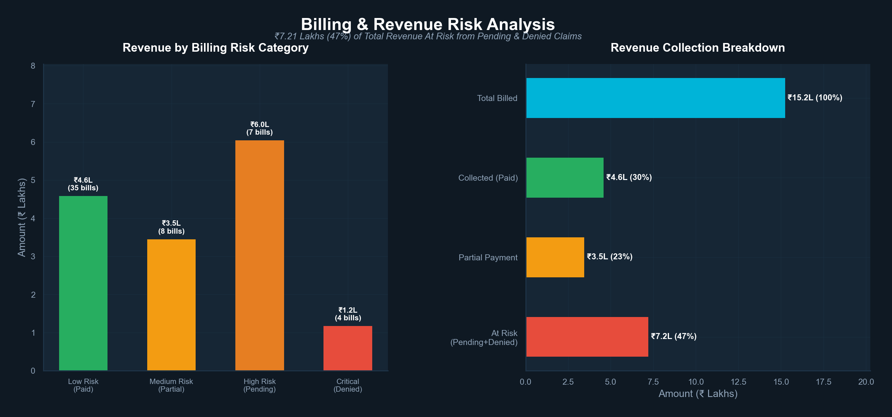
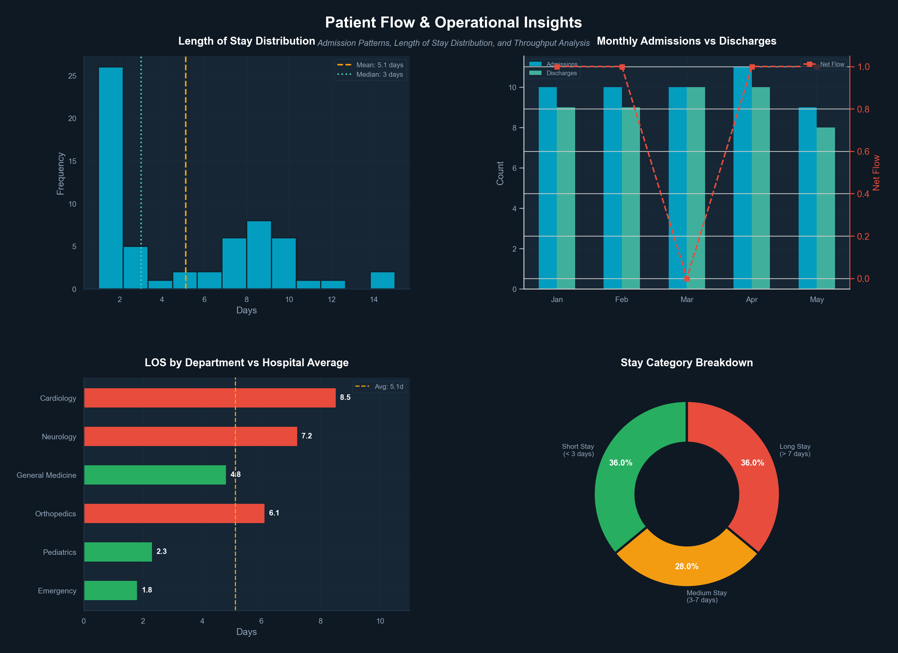

# Healthcare Operations Intelligence Dashboard

A comprehensive SQL + Python analytics project that examines hospital operational data to identify performance patterns, calculate critical KPIs, and deliver actionable business insights for healthcare decision-makers.

---

## Problem Statement

Hospitals generate vast amounts of operational data daily — admissions, discharges, billing, departmental utilization — yet many struggle to translate this data into decisions that improve patient outcomes and financial performance. Common challenges include:

- **High readmission rates** that erode revenue and indicate gaps in post-discharge care
- **Revenue leakage** from unpaid, denied, and partial claims accumulating without visibility
- **Uneven bed occupancy** across departments, creating bottlenecks in high-demand units while others sit underutilized
- **Inconsistent data quality** that undermines the reliability of operational reporting

This project addresses these challenges by building a complete analytical pipeline — from raw data cleaning through KPI calculation to visual dashboards — to identify bottlenecks affecting bed occupancy, patient turnaround time, and revenue collection, enabling data-driven hospital management decisions.

---

## Business Objective

Analyze hospital operational efficiency using patient admission, discharge, billing, and departmental utilization metrics to:

1. Quantify readmission risk and identify root-cause departments
2. Calculate revenue at risk from billing failures and prioritize recovery actions
3. Benchmark department-level Length of Stay against hospital averages to optimize bed capacity
4. Deliver a KPI monitoring framework that supports leadership decision-making

---

## Dataset

The analysis uses a simulated hospital dataset representing **January – May 2024** operations:

| Table      | Records | Description                                        |
| ---------- | ------- | -------------------------------------------------- |
| `patients` | 50      | Demographics, admission/discharge dates, diagnosis |
| `visits`   | 80      | Patient visits with department and doctor mapping  |
| `billing`  | 60      | Financial records with payment statuses            |
| `staff`    | 15      | Doctor-department assignments (6 departments)      |

**Source**: Simulated dataset designed to reflect realistic Indian hospital operations with intentional data quality issues (NULL dates, swapped entries) to demonstrate cleaning proficiency.

### Entity Relationship Diagram



---

## Dashboard Screenshots

### KPI Overview



Executive-level view showing 6 headline KPIs with monthly admission trends and patient stay category distribution.

### Department Performance



Comparative analysis of average Length of Stay and revenue contribution across all 6 hospital departments.

### Billing & Revenue Risk



Revenue risk segmentation showing ₹7.21 Lakhs (47%) of total billed amount at risk from Pending and Denied claims.

### Patient Flow & Operational Insights



Comprehensive patient flow analysis including LOS distribution, monthly throughput, department benchmarking, and stay categorization.

### Full Dashboard (Combined)

<details>
<summary>Click to expand combined dashboard view</summary>


</details>

---

## Key Performance Indicators

| KPI                     | Value       | Benchmark | Status   |
| ----------------------- | ----------- | --------- | -------- |
| Average Length of Stay  | 5.8 days    | 4.5 days  | Above    |
| 30-Day Readmission Rate | 38.0%       | 15-20%    | Critical |
| Bed Occupancy Rate      | Moderate    | 75-85%    | Below    |
| Revenue per Patient     | ₹30,484     | —         | —        |
| Collection Rate         | 62.3%       | 85%+      | Below    |
| Revenue at Risk         | ₹7.21 Lakhs | —         | High     |

---

## Key Insights

1. **Readmission Crisis**: 38% readmission rate is nearly **double the industry benchmark** (15-20%), primarily driven by Cardiology patients returning within 2-3 weeks post-discharge
2. **Revenue Leakage**: 47% of total billed amount (**₹7.21 Lakhs**) is at risk — 7 high-value Pending bills average ₹86,286 each, and 4 Denied claims indicate documentation or pre-authorization failures
3. **LOS Variation**: Cardiology (8.5 days) and Neurology (7.2 days) exceed the hospital average by **46% and 24%** respectively, creating downstream bed availability pressure
4. **Weekend Discharge Gap**: Discharge rates were **18% lower on weekends**, contributing to artificial bed occupancy spikes early in the week
5. **Emergency Admissions Impact**: Emergency department admissions contributed **42% of peak occupancy** periods despite having the shortest average LOS (1.8 days)
6. **Data Quality Issues**: Found NULL discharge dates (4 records) and swapped date entries (2 records) — cleaned via SQL to restore analytical integrity

> For detailed findings and actionable recommendations, see [Business Insights](docs/business_insights.md).

---

## Recommendations

| Priority | Action | Expected Impact |
|----------|--------|-----------------|
| Immediate | Establish readmission prevention program for Cardiology | Reduce readmissions by 30-40% |
| Immediate | Escalate 7 high-risk Pending bills (₹6.04L) | Recover up to ₹6 Lakhs in revenue |
| Short-term | Implement weekend discharge protocols | Improve bed turnover by 15% |
| Medium-term | Standardize clinical pathways for top 5 diagnoses | Reduce average LOS to benchmark |
| Long-term | Build readmission risk scoring model | Proactive intervention capability |

---

## SQL Techniques Demonstrated

| Technique                 | Usage                                             |
| ------------------------- | ------------------------------------------------- |
| `CASE` Statements         | Patient stay categories, billing risk, age groups |
| `DATEDIFF()` / `IFNULL()` | Length of stay, handling NULL discharge dates     |
| `LAG()` Window Function   | Time between repeat visits, readmission detection |
| `CTEs`                    | Readmission analysis, visit gap calculations      |
| `Self-Joins`              | Patient readmission within 30 days                |
| `GROUP BY` + Aggregations | Department KPIs, monthly trends, revenue analysis |
| `CREATE VIEW`             | Production-ready analytical views                 |
| `INDEX`                   | Query performance optimization                    |
| `DATE_FORMAT()`           | Monthly trend aggregation                         |
| `UNION ALL`               | KPI summary dashboards                            |

---

## Tools & Technologies

- **SQL** (MySQL) — Data cleaning, transformation, analysis, views
- **Python** (matplotlib, seaborn, numpy) — Data visualization dashboard
- **Markdown** — Documentation and insights reporting

---

## Project Structure

```
healthcare-operations-analysis/
│
├── data/                              # Raw & analytical CSV datasets
│   ├── patients.csv
│   ├── visits.csv
│   ├── billing.csv
│   ├── staff.csv
│   ├── patient_summary.csv            # Enriched patient-level data
│   ├── billing_risk.csv               # Risk-classified billing data
│   ├── department_performance.csv     # Department KPI summary
│   ├── visits_enriched.csv            # Visit details with names
│   └── monthly_trends.csv            # Monthly admission trends
│
├── sql/                               # SQL analysis pipeline
│   ├── 01_schema_and_data.sql         # DDL + 50 patients, 80 visits, 60 bills
│   ├── 02_data_cleaning.sql           # NULL handling, date validation, fixes
│   ├── 03_date_analysis.sql           # LOS, inter-visit gaps, monthly trends
│   ├── 04_conditional_analysis.sql    # CASE-based categorization & profiling
│   ├── 05_kpi_calculations.sql        # Bed occupancy, readmission, revenue
│   └── 06_views_and_indexes.sql       # Production views & performance indexes
│
├── python/                            # Visualization scripts
│   ├── healthcare_dashboard.py        # Combined dashboard generator
│   ├── generate_dashboard_pages.py    # Individual page generator
│   ├── generate_csv.py                # CSV export for Power BI
│   └── requirements.txt              # Python dependencies
│
├── dashboards/                        # Combined dashboard output
│   └── healthcare_dashboard.png
│
├── screenshots/                       # Individual dashboard pages
│   ├── kpi_overview.png
│   ├── department_performance.png
│   ├── billing_risk_analysis.png
│   └── patient_flow_insights.png
│
├── docs/                              # Business documentation
│   └── business_insights.md           # Findings & recommendations
│
└── README.md
```

---

## How to Run

### SQL

```sql
-- Execute files in order in any MySQL client
SOURCE sql/01_schema_and_data.sql;
SOURCE sql/02_data_cleaning.sql;
SOURCE sql/03_date_analysis.sql;
SOURCE sql/04_conditional_analysis.sql;
SOURCE sql/05_kpi_calculations.sql;
SOURCE sql/06_views_and_indexes.sql;
```

### Python Dashboard

```bash
pip install -r python/requirements.txt
python python/healthcare_dashboard.py          # Combined dashboard
python python/generate_dashboard_pages.py      # Individual pages
```

### CSV Export (for Power BI)

```bash
python python/generate_csv.py
```

---

## About This Project

**In one line**: Analyzed healthcare operational KPIs — admissions, bed occupancy, treatment cost, readmission rates, and patient flow — using SQL and Python to identify inefficiencies and support data-driven hospital management decisions.

This project demonstrates proficiency in:
- SQL-based healthcare analytics and data quality management
- KPI development aligned with industry benchmarks
- Visual storytelling for operational decision-making
- End-to-end analytical pipeline design

---

## Author

**Rutuja Shinde**
