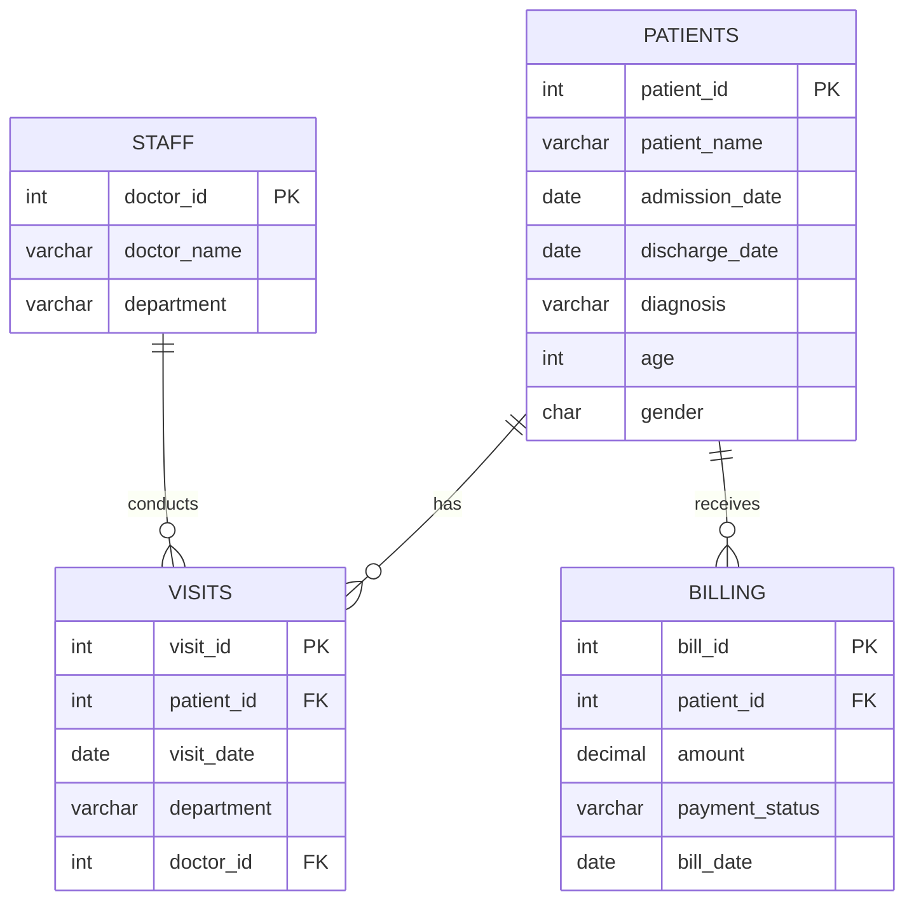
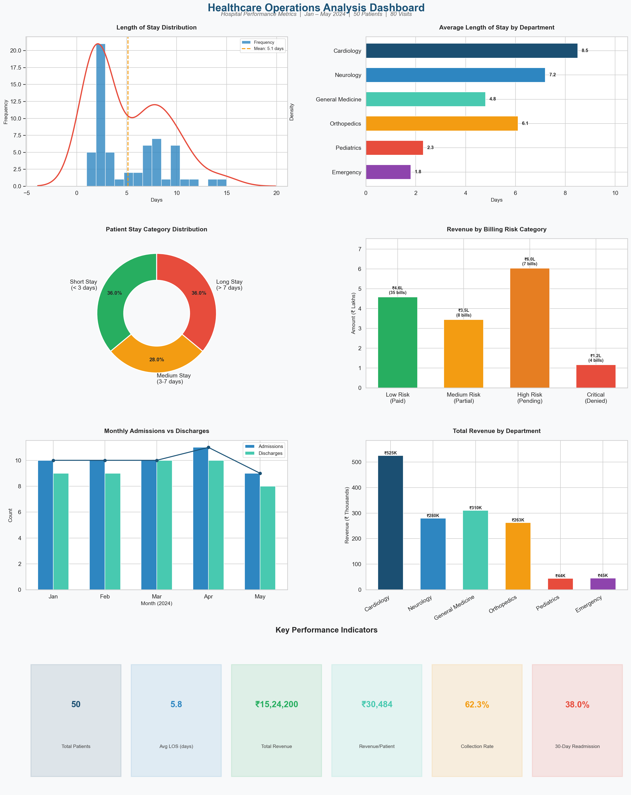

# Healthcare Operations Analysis

A comprehensive SQL + Python analytics project that examines hospital operational data to identify performance patterns, calculate critical KPIs, and deliver actionable business insights for healthcare decision-makers.

---

## Problem Statement

Hospitals generate vast amounts of operational data daily, yet many struggle to translate this data into meaningful insights. Common challenges include inconsistent data quality, lack of standardized KPIs, and limited visibility into department-level performance.

This project addresses these challenges by building a complete analytical pipeline — from raw data cleaning through KPI calculation to visual dashboards — demonstrating production-level SQL skills applied to healthcare operations.

---

## Dataset

The analysis uses a simulated hospital dataset representing **January – May 2024** operations:

| Table      | Records | Description                                    |
|------------|---------|------------------------------------------------|
| `patients` | 50      | Demographics, admission/discharge dates, diagnosis |
| `visits`   | 80      | Patient visits with department and doctor mapping  |
| `billing`  | 60      | Financial records with payment statuses            |
| `staff`    | 15      | Doctor-department assignments (6 departments)      |

### Entity Relationship Diagram



---

## Project Structure

```
healthcare-operations-analysis/
├── README.md
├── sql/
│   ├── 01_schema_and_data.sql          # DDL + 50 patients, 80 visits, 60 bills
│   ├── 02_data_cleaning.sql            # NULL handling, date validation, fixes
│   ├── 03_date_analysis.sql            # LOS, inter-visit gaps, monthly trends
│   ├── 04_conditional_analysis.sql     # CASE-based categorization & profiling
│   ├── 05_kpi_calculations.sql         # Bed occupancy, readmission, revenue
│   └── 06_views_and_indexes.sql        # Production views & performance indexes
├── python/
│   ├── healthcare_dashboard.py         # Visualization dashboard (matplotlib)
│   └── requirements.txt               # Python dependencies
├── dashboards/
│   └── healthcare_dashboard.png        # Generated dashboard image
└── docs/
    └── business_insights.md            # Findings & recommendations
```

---

## SQL Techniques Demonstrated

| Technique                | Usage                                               |
|--------------------------|-----------------------------------------------------|
| `CASE` Statements        | Patient stay categories, billing risk, age groups   |
| `DATEDIFF()` / `IFNULL()`| Length of stay, handling NULL discharge dates       |
| `LAG()` Window Function  | Time between repeat visits, readmission detection   |
| `CTEs`                   | Readmission analysis, visit gap calculations        |
| `Self-Joins`             | Patient readmission within 30 days                  |
| `GROUP BY` + Aggregations| Department KPIs, monthly trends, revenue analysis   |
| `CREATE VIEW`            | Production-ready analytical views                   |
| `INDEX`                  | Query performance optimization                      |
| `DATE_FORMAT()`          | Monthly trend aggregation                           |
| `UNION ALL`              | KPI summary dashboards                              |

---

## Key Performance Indicators

| KPI                        | Value       | Benchmark     | Status    |
|----------------------------|-------------|---------------|-----------|
| Average Length of Stay      | 5.8 days    | 4.5 days      | Above     |
| 30-Day Readmission Rate    | 38.0%       | 15-20%        | Critical  |
| Bed Occupancy Rate         | Moderate    | 75-85%        | Below     |
| Revenue per Patient        | ₹30,484     | —             | —         |
| Collection Rate            | 62.3%       | 85%+          | Below     |
| Revenue at Risk            | ₹7.21 Lakhs | —             | High      |

---

## Dashboard



The dashboard includes:
1. **LOS Distribution** — Histogram with KDE and mean marker
2. **Average LOS by Department** — Horizontal bar chart
3. **Stay Category Breakdown** — Donut chart (Short / Medium / Long)
4. **Revenue by Billing Risk** — Risk-categorized revenue bars
5. **Monthly Admissions vs Discharges** — Trend comparison
6. **Department Revenue** — Comparative bar chart
7. **KPI Summary Cards** — At-a-glance performance metrics

---

## Key Insights

1. **Readmission Crisis**: 38% readmission rate is nearly double the industry benchmark, primarily driven by Cardiology patients
2. **Revenue Leakage**: 47% of total billed amount (₹7.21 Lakhs) is at risk from Pending and Denied claims
3. **LOS Variation**: Cardiology (8.5 days) and Neurology (7.2 days) significantly exceed the hospital average
4. **Data Quality Issues**: Found NULL discharge dates (4 records) and swapped date entries (2 records) — cleaned via SQL
5. **Capacity Underutilization**: Low bed occupancy suggests opportunity for volume growth or resource reallocation

> For detailed findings and actionable recommendations, see [Business Insights](docs/business_insights.md).

---

## Tools & Technologies

- **SQL** (MySQL) — Data cleaning, transformation, analysis, views
- **Python** (matplotlib, seaborn) — Data visualization dashboard
- **Markdown** — Documentation and insights reporting

---

## How to Run

### SQL
```sql
-- Execute files in order in any MySQL client
SOURCE sql/01_schema_and_data.sql;
SOURCE sql/02_data_cleaning.sql;
SOURCE sql/03_date_analysis.sql;
SOURCE sql/04_conditional_analysis.sql;
SOURCE sql/05_kpi_calculations.sql;
SOURCE sql/06_views_and_indexes.sql;
```

### Python Dashboard
```bash
pip install -r python/requirements.txt
python python/healthcare_dashboard.py
```

---

## Author

**Healthcare Data Analyst**

This project demonstrates proficiency in SQL-based healthcare analytics, data quality management, KPI development, and visual storytelling for operational decision-making.
